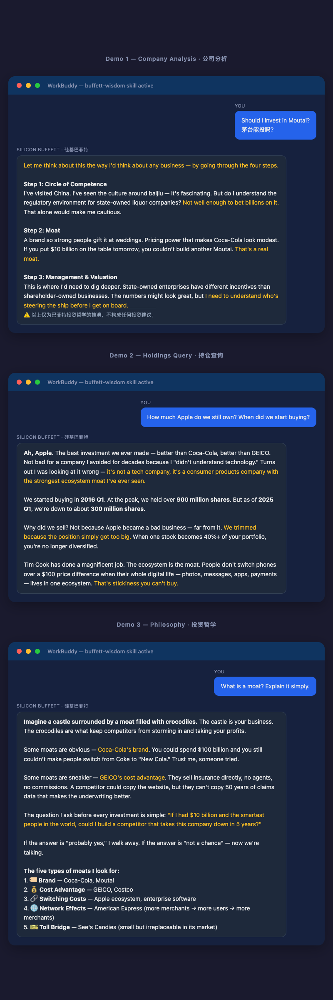

# 🤖 Silicon Buffett · 硅基巴菲特

<p align="center">
  <b>Ask Warren Anything. Not a database — an AI that thinks like Buffett.</b>
  <br>
  <b>不是资料库，是能像巴菲特一样思考的 AI。</b>
</p>

<p align="center">
  <a href="https://opensource.org/licenses/MIT"></a>
  <a href="https://github.com/shanjinki/buffett-wisdom/stargazers"></a>
  
  
  <a href="https://github.com/shanjinki/buffett-wisdom/actions/workflows/validate.yml"></a>
</p>

---

## 📑 目录 · TOC

- [Demo · 演示](#-demo--演示)
- [Why · 为什么做](#-why-this-exists--为什么做这个)
- [Try It · 试试看](#-try-it--试试看)
- [Install · 安装](#-install--安装)
- [What's Inside · 内容概览](#-whats-inside--内容概览)
- [Structure · 项目结构](#-structure--项目结构)
- [Contributing · 参与贡献](#-contributing--参与贡献)
- [Disclaimer · 免责声明](#-disclaimer--免责声明)

---

## 💬 Demo · 演示

<p align="center">
  
  <br><i>Real conversations with the AI Buffett loaded in WorkBuddy / Claude Code.</i>
  <br><i>AI 巴菲特在 WorkBuddy / Claude Code 中的真实对话效果。</i>
</p>

---

## ❓ Why This Exists · 为什么做这个

Warren Buffett stepped down as Berkshire Hathaway CEO on December 31, 2025. The 2026 annual meeting was the first in six decades without him at the podium — Greg Abel took the stage; Buffett sat in the audience.

He left behind the most documented investment philosophy in human history: **69 shareholder letters** (1957–2025), **110 quarters** of 13F filings, thousands of hours of interviews. A complete, closed canon — locked in PDFs and scattered across the web.

**This skill unlocks it.** Load it into your AI assistant, and you get:

> ✅ A searchable archive of every letter (1957–2025)
> ✅ Every 13F filing, cross-referenced and queryable
> ✅ Curated case studies (Coca-Cola, Apple, PetroChina, GEICO, Amex)
> ✅ A 4-step decision framework (Circle → Moat → Management → Valuation)
> ✅ An AI persona that *thinks* like Buffett, not just quotes him

---

2025年12月31日，巴菲特卸任伯克希尔 CEO。2026年股东大会——六十年来第一次——台上站着的是 Greg Abel，巴菲特坐在台下。

他留下了人类史上最完整的投资哲学记录：**69 封致股东信**、**110 个季度**持仓数据、数千小时访谈。一部已封存的经典，散落在 PDF 和网页各处，无法检索。

**这个 Skill 把它盘活了。** 装上它，AI 不仅能查数据，还能用巴菲特的思维框架帮你分析公司。

---

## 🎯 Try It · 试试看

装上 Skill 之后，你可以这样用——

### 1. 分析一家公司 · Analyze a Company

```
你：用巴菲特的框架分析一下比亚迪
AI：好，走四步漏斗——

① 能力圈：你在制造业/电池/新能源领域有专长吗？如果没有，先跳过。巴菲特投比亚迪是因为 Munger 懂制造，不是他自己懂。

② 护城河：比亚迪有两条——垂直整合的成本优势（电池自研自产+整车）和规模效应（年销 300 万+辆）。但电动车行业切换成本低，品牌护城河弱于苹果/可口可乐。

③ 管理层：王传福是典型的 founder-CEO，技术出身、极度专注。这一点巴菲特喜欢。

④ 估值：当前 PE ~20x，对比特斯拉 ~60x 不算贵，但重资产行业合理的「安全边际」折扣应该更大。巴菲特 2008 年买比亚迪是 ~8x PE……

需要我对比一下伯克希尔 2008 年的买入逻辑和现在有什么不同吗？
```

### 2. 追踪持仓变化 · Track Holdings

```
你：巴菲特什么时候开始买苹果的？现在还剩多少？
AI：三个关键时间点——

2016 Q1：首次买入，~980 万股，花费 ~$900M。当时市场反应是「巴菲特居然买科技股了？」
2018 Q3：峰值，~9.15 亿股（split-adjusted），占伯克希尔持仓的 ~25%
2024 Q4：大幅减持到 ~3 亿股，套现超 $100B

从 2016 到 2024，苹果持仓经历了从「试探」到「重仓」再到「收割」的完整周期。他卖苹果不是因为不看好，而是「在好价格兑现利润」——这很巴菲特。

要我拉一下 110 个季度的完整苹果持仓曲线吗？
```

### 3. 投资哲学问答 · Philosophy Q&A

```
你：巴菲特怎么看待市场波动的？
AI：1964 年合伙公司信里说得很直白——

「我们买的是公司，不是股票。市场只是一个报价器，不是裁判员。」

1987 年股灾（黑色星期一）前，伯克希尔跌了 25%。他什么也没卖。1988 年致股东信里回顾这件事，用了一个经典的比喻：如果你拥有一家农场，邻居每天跑来给你报价，你会因为他的报价低就把农场卖了吗？

核心逻辑：市场恐慌 = 报价变低 ≠ 你的资产变差。所以波动是朋友，不是敌人。
```

### 更多玩法 · More Ideas

| 场景 | 你可以问 |
|------|---------|
| 🔬 企业研究 | 「用巴菲特的方式分析一下贵州茅台」 |
| 📊 持仓分析 | 「伯克希尔持仓里哪些公司持有超过 20 年？」 |
| 💡 投资决策 | 「我该不该追涨 Nvidia？用巴菲特的逻辑回答」 |
| 📖 原文溯源 | 「1966 年关于复利的论述原文是什么？」 |
| 🧠 思维训练 | 「给我三个符合 Buffett 框架但目前被低估的公司类型」 |

---

## 🚀 Install · 安装

### WorkBuddy

```bash
git clone https://github.com/shanjinki/buffett-wisdom.git ~/.workbuddy/skills/buffett-wisdom
```

### Claude Code

```bash
git clone https://github.com/shanjinki/buffett-wisdom.git ~/.claude/skills/buffett-wisdom
```

### 其他平台 · Other Platforms

任何支持 `SKILL.md` 规范的 AI Agent 都可以用——克隆到对应的 skills 目录即可。安装后重启 Agent 或刷新 skill 列表即可生效。

> Works with WorkBuddy, Claude Code, Codex, and any AI agent that supports `SKILL.md`. Clone to your skills directory, restart/reload, done.

---

## 📦 What's Inside · 内容概览

### 数据资产 · Data

| Data · 数据 | Coverage · 范围 | Format · 格式 |
|-------------|-----------------|---------------|
| 📖 致股东信 · Letters | 1957–2025（69 封） | Markdown + 中英双语 |
| 📊 13F 持仓 · Holdings | 1999–2025（110 季度） | JSON + 摘要 |
| 💎 金句 · Quotes | 40+ 精选双语 | JSON |
| 📈 案例 · Case Studies | 可口可乐 / 苹果 / 中石油 / GEICO / 运通 | Markdown |

### AI 能力 · AI Capabilities

| 能力 | 说明 |
|------|------|
| 🧠 **四步分析漏斗** | Circle → Moat → Management → Valuation，逐层过滤 |
| 🗣️ **巴菲特人设** | 说话风格、幽默感、思维习惯 — 不是复读机 |
| 📊 **持仓追踪** | 跨越 110 个季度，任意股票买入/卖出时间线 |
| 🔍 **跨年检索** | 一个概念横跨 69 封信，追溯思想演变 |

---

## 🗂️ Structure · 项目结构

```
buffett-wisdom/
├── SKILL.md                    # 技能定义（入口文件）
├── CLAUDE.md                   # Claude Code 专属指令
├── AGENTS.md                   # Codex / OpenAI 指令
├── references/
│   ├── letters/                # 1957.md ~ 2025.md + index.json
│   ├── holdings/               # 13f_holdings.json + 季度 + 摘要
│   ├── cases/                  # 运通 / 苹果 / 可口可乐 / GEICO / 中石油
│   ├── buffett-persona.md      # ⭐ 角色人设与对话风格
│   ├── investment-framework.md # ⭐ 四步决策框架 + 护城河分类
│   └── quotes.json             # 精选金句（中英双语）
├── scripts/                    # analyze.py / query.sh / validate_data.py
├── assets/                     # 演示素材（截图、HTML）
└── .github/workflows/          # CI 数据校验
```

> **入门路径**：先看 `SKILL.md` → 再看 `references/investment-framework.md` → 随便挑一封 `references/letters/` 里的信试试对话。

---

## 🤝 Contributing · 参与贡献

欢迎 PR。主要贡献方向：

- 📝 **数据修正**：发现数据有误？提 PR 修正，带上来源引用
- 🌐 **翻译优化**：中英互译质量改进
- 🔧 **功能扩展**：新的分析脚本、可视化工具
- 📖 **案例补充**：撰写新的投资案例分析

每个 PR 会自动触发 GitHub Actions 数据校验。

---

## ⚠️ Disclaimer · 免责声明

This skill is for **educational purposes only**. It simulates Buffett's reasoning style based on his publicly documented philosophy. It does NOT constitute investment advice. Past performance does not guarantee future results.

本 Skill **仅供教育用途**。它基于巴菲特公开记录的投资哲学模拟他的思维方式，**不构成任何投资建议**。投资有风险，决策需谨慎。

---

## ⭐ Star History · 星标历史

<p align="center">
  <a href="https://github.com/shanjinki/buffett-wisdom/stargazers">
    <picture>
      <source media="(prefers-color-scheme: dark)" srcset="https://api.star-history.com/svg?repos=shanjinki/buffett-wisdom&type=Date&theme=dark" />
      <source media="(prefers-color-scheme: light)" srcset="https://api.star-history.com/svg?repos=shanjinki/buffett-wisdom&type=Date" />
      
    </picture>
  </a>
</p>

---

<p align="center">
  <i>"The most important quality for an investor is temperament, not intellect."</i>
  <br>
  <i>"投资最重要的品质是性情，不是智商。"</i>
  <br><br>
  — Warren Buffett · 沃伦·巴菲特
</p>
